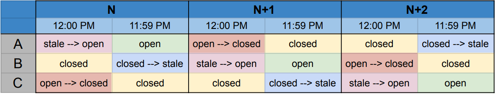
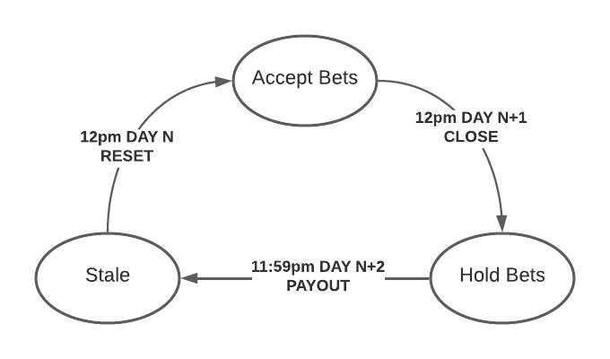
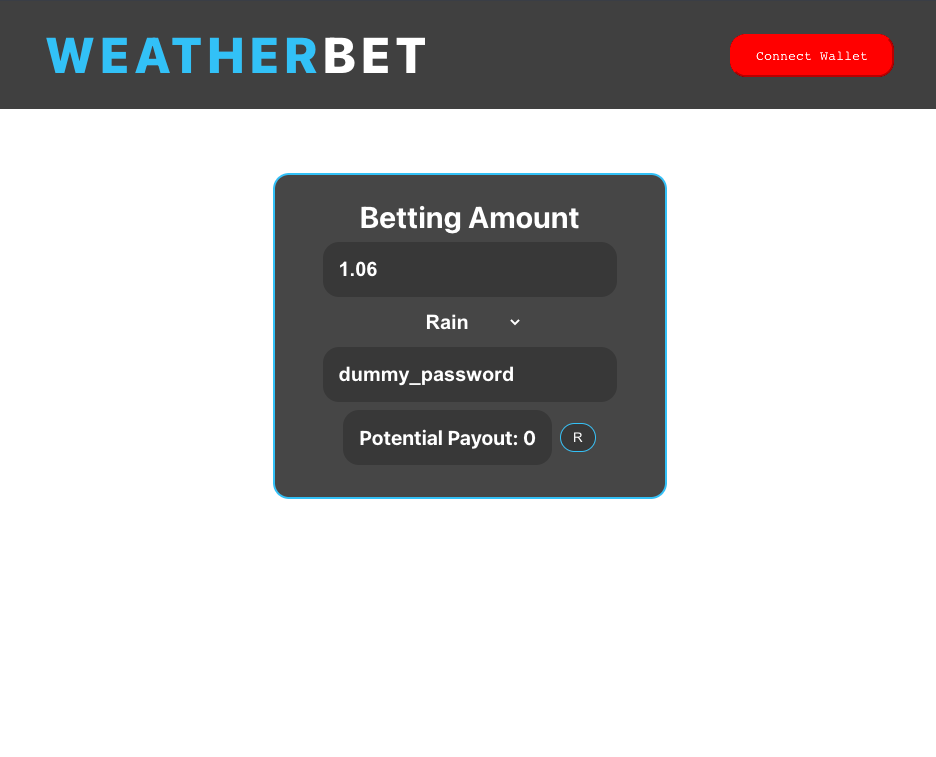

# Final Report on WeatherBet

# Title, Authors

Title: WeatherBet

Authors: George Litvinov (gl2157), Maximo Oen (mmo2134), Jacky Wong (hw2813)

# Usage

**Smart-Contracts:** `npm install` in root directory then deploy via hardhat
**Front-End Client:** `npm install && npm start` in `/client` directory
**Back-End Server:** `npm install && node index.js` in `/server` directory

# Abstract

WeatherBet is a web application with smart contracts allowing users to bet against each other on the weather in NYC. Users only bet against each other and no other entity. All bets must be placed by 12pm EST the day before. Bets are done for 12:00am to 11:59pm EST of a specific day.

# DAPP Description

### **Smart Contract**

Purpose of the smart contract is to hold the funds of the bet, set odds and payout. There are three smart contracts that are used on a rotational basis and can have three states:

- **Open:** The contract is open for betting. Users are able to place bets for or against rain.
- **Closed:** The contract is closed for betting and is waiting for resolution. Resolution happens once the bet day has reached 11:59pm EST and the contract is paid out on.
- **Stale:** The contract has paid out the winners, and is waiting to be reset and opened.

The purpose of the three smart contract rotations is due to the fact that we chose a design where the betting closes at 12pm on day N, with bets being placed for day N+1 (contract A). Therefore, A’s resolution/payout will only happen at the end of day N+1. 

Meanwhile, a second contract, contract B, opens at 12pm on day N, with bets being placed for day N+2. B will close at 12pm on day N+1, when A is still waiting for it’s resolution.

Therefore, contract C is required so that it is able to be opened at 12pm on Day N+1 for bets being placed on day N+3. It will then be closed at 12pm on Day N+2, when contract A is stale and can be reset.



Time Step Definition of each Contract



Contract State-machine

### Back-End Server

The back-end server is the manager. It controls the contract scheduling, state updating. It has three main smart contract controls :

- **Reset Logic:** calls the relevant contract to be reset.
- **Expire Logic:** calls the relevant contract to be closed.
- **Payout Logic:** determines whether it has rained or not for the relevant day using the [National Weather Service API](https://www.weather.gov/documentation/services-web-api) and calls relevant contract to be paid out.

In addition to that, the back-end server fetches bet odds information from the smart contract that is to be relayed to the front-end client and relays the currently open smart contract that accepts bets.

The back-end server has two chron-jobs that run at noon and midnight EST and advance the state of the contracts.

### Front-End Client

The front-end client’s main purpose is to connect the user to the smart contract in order to allow him to place bets. It’s functionality can be summarized in the following 3 features:

1. Fetch odds and current contract from back-end server
2. Connect user’s wallet
3. Allow user to choose a bet category, amount and send it to the smart contract

# Originality/novelty

While betting application is commonplace in Web3, WeatherBet allows users to bet on the weather by connecting with the Weather API. Furthermore, users are restrained to a 24-hour betting window and also bet only against each other.

This is a proof-of-concept project in establishing the architecture and framework, with a potential to be expanded and generalized for gambling and auxiliary applications.

Furthermore, to our best knowledge, this is the first DAPP of it’s kind on the Computecoin Network and can be adapted for educational purposes in displaying what is possible on the network.

# Showcase of your DAPP (e.g., one example from user’s experience)

As discussed in DAPP Description section, we have a smart contract to manage the betting activities among users. Below is flow of a user experience/story in navigating our web app to interact with the smart contracts.



UI of WeatherBet

- **Connect Wallet**: The afternoon of day N, Users visit the WeatherBet landing page and click connect wallet button in connecting their Ale Wallet with our web app.
- **View Odds**: Users can view the current odds based on the number of users on each side betting on the weather outcome of day N + 2. Users can use this information in considering which side (e.g., rain or no rain) to bet on.
- **Place Bet**: Once decided, users provide the password, bet amount, and the weather outcome of day N + 2 to enter the bet.
- **Successive Bets**: Should the users decide they want to add bets to either weather outcome, they can continue to do so.
- **Bets Frozen**: 24 hours after the betting window was opened at noon on day N, the betting window closes and all user bets are frozen until the contract resolves them.
- **Another Bet**: Meanwhile, another Bet pool at noon of day N + 1 will now be opened for users to place bets on.

# Conclusion

WeatherBet is a React application with a Solidity smart contract on the Computecoin Network that allows users to bet against each other on the weather in NYC. This application is a great display of the capabilities of the developing network. 

# References

### Github Repo

[https://github.com/Blockchain-GJM/WeatherBet](https://github.com/Blockchain-GJM/WeatherBet)

### Deployed instance:

[35.232.186.212](http://35.232.186.212:3001/):3000

### Deployed Smart Contract to Huygens_Dev

```bash
CONTRACT A:
> npx hardhat run --network Huygens_dev scripts/deploy.js
WeatherBet deployed to: 0x639eaA95905F141ff1d43B08D287C8d21789E582

CONTRACT B:
> npx hardhat run --network Huygens_dev scripts/deploy.js
WeatherBet deployed to: 0x29a83915F25BB3092EbdDb8eC47c92f3C3D62AEA

CONTRACT C:
> npx hardhat run --network Huygens_dev scripts/deploy.js
WeatherBet deployed to: 0x8D586141605C08002E3c87f9c6aF31282528413F
```
